Let’s start out by using the Try Azure Functions experience to create a simple HTTP trigger function..

Here is a very simple HTTP trigger “Hello World” example. Try it yourself:

1. Login to Try Functions (go to [https://functions.azure.com](https://functions.azure.com/) and click the green Try-It-For-Free button)
2. Choose Webhook + API scenario (many other templates are available for other scenarios)
3. Choose your programming language between C# or JavaScript (node.js). Azure Functions support additional languages like F#, Python, PowerShell and CMD.
4. Click “Create this function” button, which will prompt you to login
5. Login with your selected social identity, wait for few seconds… and you have an HTTP trigger function ready for use

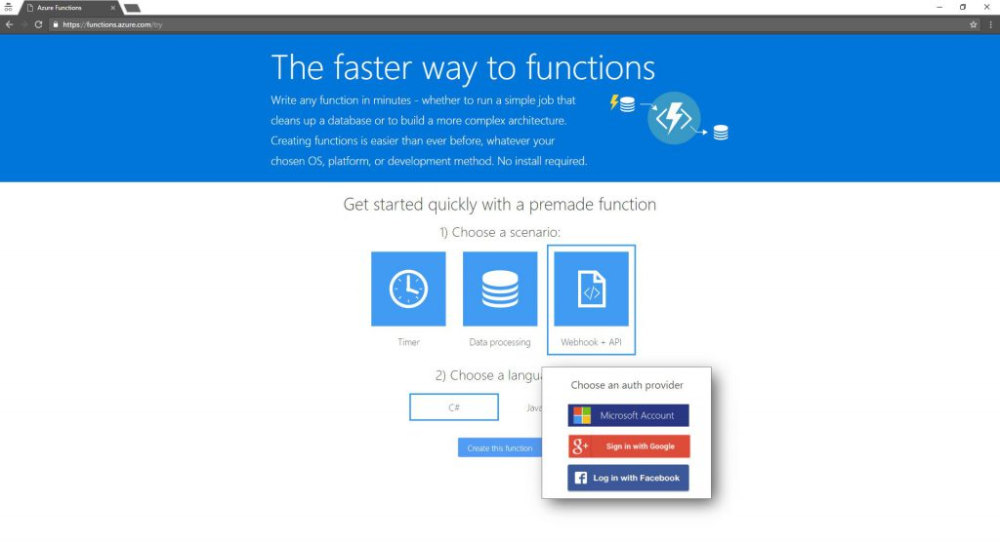
 
You can copy the Azure Function URL (highlighted below) and paste it into your browser. You should receive a response. You might want to add _&name=YourName_ to the Function URL as the default http trigger template expects name query parameter. Just like that, you created a fully working HTTP endpoint in the cloud.

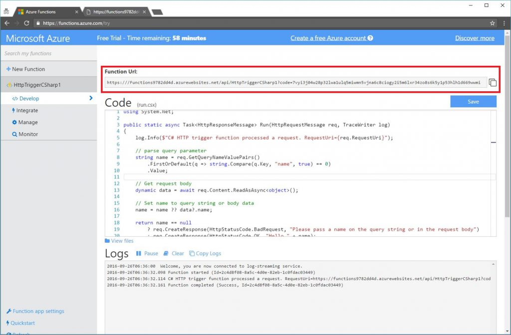

While this was is an impressive example of how easy it is to create an HTTP endpoint in the cloud, it turns out you can do quite a lot more!  Let’s put together the following scenario. Upload an image that includes some text in it, run an OCR on the image to extract the text, store the text, and finally retrieve both image and text. For small images or for a low volume of image uploads, you can probably do it all in a single Function. However, we want to leverage the Serverless nature of Azure Functions to create a scalable and highly performant design. To do so, we will create three functions:

- An HTTP trigger function exposing simple REST API to upload an image.
- A blob trigger function that will extract the text from the image when it id uploaded to the blob storage.
- Another HTTP trigger function exposing simple REST API to query the results of the text extraction.

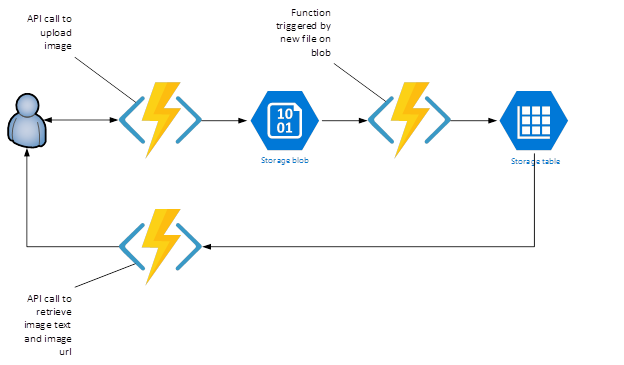
 
### First Function – a simple REST API uploading an image to Azure Blob

You can imagine a scenario in which you have a web or mobile app that needs to upload images for processing. A function receiving the uploaded image can expect an HTTP POST from an HTML form that might look like this:

```html
<label>
     Using JQuery
</label>
<input name=”file” type=”file” id=”me” />
<input type=”button” id=”Upload” value=”Upload” />
</form>
```

We want our function to receive an image and store it in Azure Blob Storage. This is a classic reader/writer pattern, where you want your API layer to do as little complex computing as possible.  The Azure Functions concept of Bindings enables developers to directly interact with the input and output values of Functions data sources. Those include Azure Storage Queue, Tables, and Blobs as well as Azure Event Hubs, Azure DocumentDB and more. [Click here for full list of binding](https://blogs.msdn.microsoft.com/azure.microsoft.com/en-us/documentation/articles/functions-reference/#bindings]).

Let’s add an Azure Blob output binding. On the **Integrate** tab, click New Output and choose Azure Storage Blob.

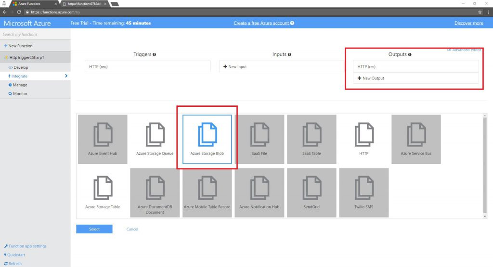

The Blob parameter name, is an input argument (parameter) passed to your Function. Just like you would expect when programing any regular function. Azure Functions takes it one step further, enabling to use such bindings without knowing anything about the underlying infrastructure. This means that you don’t need to know how Azure Storage works or install Storage SDKs to use Azure Blob as your function output. You just use the _outputBlob_ object in your function, save the image to that blob and the uploaded image will appear in your Storage Blob. In the try experience you don’t have a direct access to the underline storage account powering your Functions. However, you will see it in action by the time you complete the 3rd function. Make sure you update the Path to include _“.jpg_”, and hit Save.

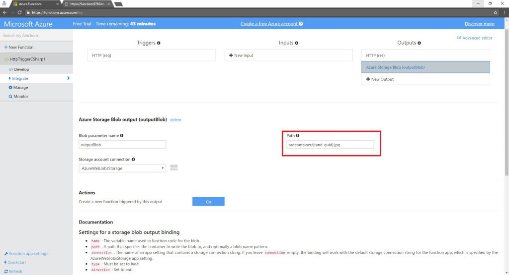

In the function code, we refer to _outputBlob _as an object that is ready to be used. This function is implemented in C# and uses _StreamProvider _to read the image data from the HTTP request and store it to an Azure Blob. I don’t have any idea how Azure Storage works. Behind the scenes Azure Functions takes care of moving data in to and out from my functions. It is like magic, quick and easy to use.

```csharp
#r "Microsoft.WindowsAzure.Storage"

using System.Net;
using Microsoft.WindowsAzure.Storage.Blob;

public static HttpResponseMessage Run(HttpRequestMessage req, Stream outputBlob, TraceWriter log) 
{
    log.Info($"C# HTTP trigger function processed a request. RequestUri={req.RequestUri}");

    HttpResponseMessage result = null; 
     
    if (req.Content.IsMimeMultipartContent())
    {
            // memory stream of the incomping request 
            var streamProvider = new MultipartMemoryStreamProvider ();

            log.Info($" ***\t before await on ReadMultpart...");
            req.Content.ReadAsMultipartAsync(streamProvider);
            log.Info($" ***\t after await on ReadMultpart...");
            
            //using a stream saves the 'last' iamge if multiple are uplaoded
            foreach (HttpContent ctnt in streamProvider.Contents)
            {
                // You would get hold of the inner memory stream here
                Stream stream = ctnt.ReadAsStreamAsync().Result;
                log.Info($"stream length = {stream.Length}"); // just to verify
                
                // save the stream to output blob, which will save it to Azure stroage blob
                stream.CopyTo(outputBlob);

                result = req.CreateResponse(HttpStatusCode.OK, "great ");
            }            
        }
        else
        {
            log.Info($" ***\t ERROR!!! bad format request ");
            result = req.CreateResponse(HttpStatusCode.NotAcceptable,"This request is not properly formatted");
        }
    return result;
}
``` 

### Second Function – Performs OCR

Let’s create the second function, called ImageOCR. This function will be triggered every time a new image file is uploaded to the blob storage container (named _outcontainer_) by the first function. Then the function will run OCR on that image to extract text embedded in it. Note, this function will run only when a new image (or any other file…) is uploaded to the blob. Again, this is Serverless in its best form, your code will run only when needed and you will pay only for that time.

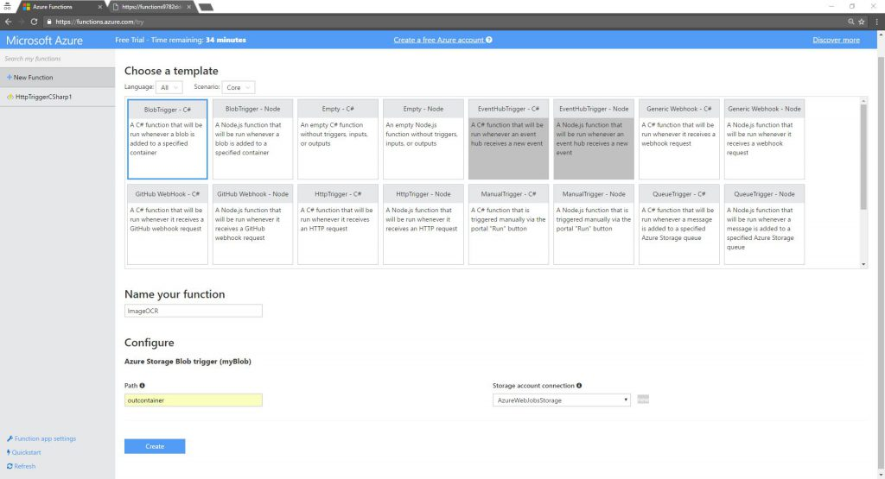

Make sure the Azure Storage Blob container name you use to trigger is the same as the Blob container name used to write the image from the first function. If you have not changed the default, the container name of the first function is _outcontainer_.

```csharp
#r "System.IO"
#r "System.Runtime"
#r "System.Threading.Tasks"
#r "Microsoft.WindowsAzure.Storage"

using System;
using System.IO;
using System.Text;
using System.Threading.Tasks;
using Microsoft.WindowsAzure.Storage.Blob;
using Microsoft.ProjectOxford.Vision;
using Microsoft.ProjectOxford.Vision.Contract;
using Microsoft.WindowsAzure.Storage.Table;

public class ImageText : TableEntity
{
    public string Text { get; set; }
    public string Uri {get; set; }
}

public static void Run( ICloudBlob myBlob, ICollector outputTable, TraceWriter log) 
{
     try  
    {
        using (Stream imageFileStream = new MemoryStream())
        {

            myBlob.DownloadToStream(imageFileStream); 
            log.Info($"stream length = {imageFileStream.Length}"); // just to verify

            //
            var visionClient = new VisionServiceClient("YOUR_KEY_GOES_HERE");

            // reset stream position to begining 
            imageFileStream.Position = 0;
            // Upload an image and perform OCR
            var ocrResult = visionClient.RecognizeTextAsync(imageFileStream, "en");
            //log.Info($"ocrResult");

            string OCRText = LogOcrResults(ocrResult.Result);
            log.Info($"image text = {OCRText}");

            outputTable.Add(new ImageText()
                            {
                                PartitionKey = "TryFunctions",
                                RowKey = myBlob.Name,
                                Text = OCRText,
                                Uri = myBlob.Uri.ToString()
                            });            
        }

    }
    catch (Exception e) 
    {
        log.Info(e.Message);
    }
}

// helper function to parse OCR results 
static string LogOcrResults(OcrResults results)
{
    StringBuilder stringBuilder = new StringBuilder();
    if (results != null && results.Regions != null)
    {
        stringBuilder.Append(" ");
        stringBuilder.AppendLine();
        foreach (var item in results.Regions)
        {
            foreach (var line in item.Lines)
            {
                foreach (var word in line.Words)
                {
                    stringBuilder.Append(word.Text);
                    stringBuilder.Append(" ");
                }
                stringBuilder.AppendLine();
            }
            stringBuilder.AppendLine();
        }
    }
    return stringBuilder.ToString();
}
```

The function is triggered by any file uploaded to the blob container. The default input parameter type of the function is string, but I will be using _ICloudBlob_, as I want to read the image as a stream and I want to get the image file name and URI. As you can see, Azure Functions binding provides a very rich experience.

To perform the OCR on a given image, I am going to use using [Microsoft Cognitive Services](https://www.microsoft.com/en-us/microsoftservices/) , also known as Project Oxford. I could use any 3

rd party tool, bring a dll that implements the algorithm, or write my own. However, leveraging other services as much as possible is a core tenant of Serverless architecture. If you don’t have a Cognitive Services account, sign up for free at [https://www.microsoft.com/cognitive-services](https://www.microsoft.com/cognitive-services)

Using the Cognitive Services is very easy, it comes down to two lines of code:

```csharp
  var visionClient = new VisionServiceClient("YOUR_KEY_GOES_HERE");
   // reset stream position to begining
   imageFileStream.Position = 0;
   // Upload an image and perform OCR
   var ocrResult = visionClient.RecognizeTextAsync(imageFileStream, "en");
```

In order to make the _ImageOCR_ function code work, you’ll need to import _ProjectOxford_ assemblies. Azure functions support _project.json_ files to identify nuget packages (for C#) to be automatically restore with the function. For node.js Azure Functions support npm.

In the Functions UI, click on View files and add project.json with the following text. once you save this file, Azure Functions will automatically restore the ProjectOxford package.
 
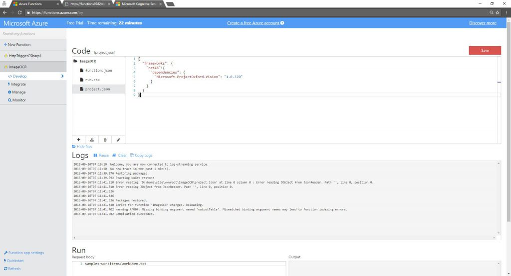

In order to make the ImageOCR function code work, you’ll need to import Project Oxford assemblies. Azure Functions supports a project.json files to identify nuget NuGet packages (for C#) to be automatically restored with the functionFunction. For node.js, Azure Functions supports npm.

In the Functions UI, click on View files and add project.json with the following text. Oonce you save this file, Azure Functions will automatically restore the Project Oxford packages.

```json
  project.json 
  {
    "frameworks": {
      "net46":{
        "dependencies": {
          "Microsoft.ProjectOxford.Vision": "1.0.370"
        }
      }
    }
  }
``` 

We want to save the results somewhere. In this Try Functions example we are using Azure Storage Table. Note – if you have an Azure Subscription, you can use many other Data Services provided by Azure to store and process the results.

Let’s add an output binding to Azure Table Store

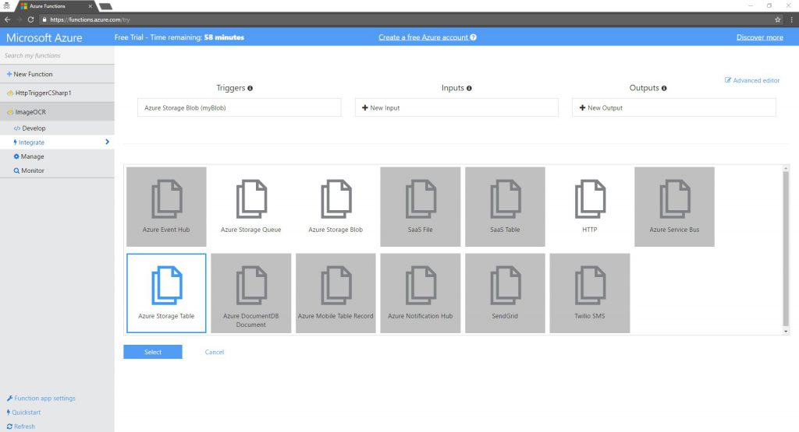
 
Next, change the Table name from the default to _ImagesText_. The Table parameter name, _outputTable_ will be used in the function code.

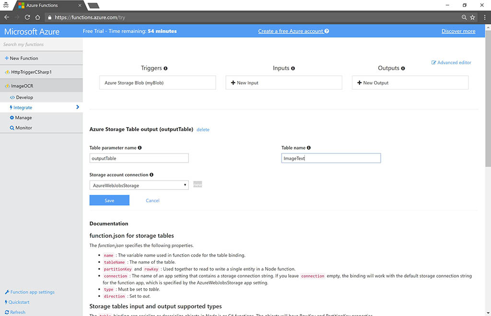

And again, just like with the blob, I don’t need to know a lot about how Azure Storage Tables work. Azure Functions is doing all the heavy lifting. We are using the _ImageText_ table to store the image Uri (pointer to the blob storing the image), the OCR results, and the table keys in the form of a GUID.

You have now completed the creation of a function that scans an image, extracts text from it and stores the results into persistent storage.

### Third Function – simple REST API to query OCR results

The last function we are going to create is of type HTTP trigger and will be used to return list of images and the text we extracted from the images in the second function.

This time we will add an Azure Storage table as an input binding, because you would expect your function to receive the table store object to work with and extract the data. As before, make sure you are using the same table name you used in the second function. Note the Partition Key, which is optional was hard-coded for _TryFunctions_.

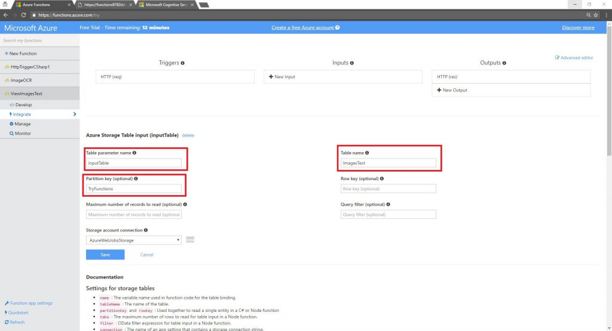

The function input argument is of type _IQueryable&lt;ImageText&gt;_, which represent a collection of results queried from Table Storage. Its ready to use without any knowledge of how Azure Table Storage works, I get a list I can work with. We create a _SimpleImageText _object representing the response and return a JSON representation of the data.

```csharp
  #r "System.IO"
  #r "System.Runtime"
  #r "System.Threading.Tasks"
  #r "Microsoft.WindowsAzure.Storage"
  #r "Newtonsoft.Json"

  using System;
  using System.Net;
  using System.IO;
  using System.Text;
  using System.Threading.Tasks;
  using Microsoft.WindowsAzure.Storage.Table;
  using Newtonsoft.Json;

  public static async Task Run(HttpRequestMessage req, IQueryable inputTable,  TraceWriter log)
  {
      log.Info($"C# HTTP trigger function processed a request. RequestUri={req.RequestUri}");

      var result = new List();

      var query = from ImageText in inputTable select ImageText;
      //log.Info($"original query --&gt; {JsonConvert.SerializeObject(query)}");

      foreach (ImageText imageText in query)
      {
          result.Add( new SimpleImageText(){Text = imageText.Text, Uri = imageText.Uri});
          //log.Info($"{JsonConvert.SerializeObject()}");
      }
//    log.Info($"list of results --&gt; {JsonConvert.SerializeObject(result)}");

      return req.CreateResponse(HttpStatusCode.OK, JsonConvert.SerializeObject(result));
  }

  // used to get rows from table
  public class ImageText : TableEntity
  {
      public string Text { get; set; }
      public string Uri {get; set; }
  }

  public class SimpleImageText
  {
      public string Text { get; set; }
      public string Uri {get; set; }
  }

```
 
### We created three functions, it is time to test them.

You can use any of your favorite tools to generate HTTP calls, including CURL, writing a simple html / Java script, or anything else. To test both HTTP functions I’ll use [Postman](https://www.getpostman.com/), using form-data as a Body to POST to the first function URL. You should receive “great” as a response and if you look at the first function log, in the Try Azure Function UI, you will notice traces from your function. If something went wrong, try debugging it… or ping me on Twitter (@yochayk)

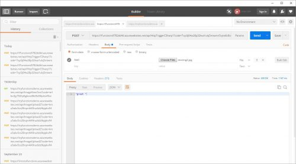 

Assuming your first function worked, go to the OCR image function and upload another image. You will notice that the OCR function got triggered, which means your first function successfully saved the image to storage and your second function picked it up. Again, you should see in the log traces from your function.

Use Postman to call the last function and you should see JSON array including two images and the text extracted from them.

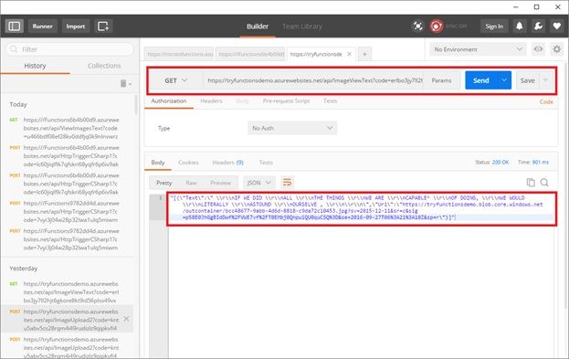

Here is [repo](https://github.com/yochay/FunctionSimpleImageUpload) with the function. Note, my solution is a little more complex and includes handling multiple uploaded files and adding a SAS token to the container.

One small note: if you want to view the images, you will need to generate a SAS token for the container, as by default, an Azure Blob Storage container permission blocks public read access. I’ve added the required code, which generates a 24 access token to images, to the _ImageViewText_ functions. You will also need to pass the blob container as input argument for the functions.

```csharp
  // IQueryable return list of image text objects
  // CloudBlobContainer used to generate SAS token to allow secure access to image file
  public static async Task Run(HttpRequestMessage req, IQueryable inputTable, CloudBlobContainer inputContainer,  TraceWriter log)
  {
      log.Info($"C# HTTP trigger function processed a request. RequestUri={req.RequestUri}");

      //get container sas token
      var st = GetContainerSasToken(inputContainer);
      //log.Info($"token --&gt; {st}");
      var result = new List();

      var query = from ImageText in inputTable select ImageText;
      //log.Info($"original query --&gt; {JsonConvert.SerializeObject(query)}");

      foreach (ImageText imageText in query)
      {
          result.Add( new SimpleImageText(){Text = imageText.Text, Uri = imageText.Uri + st});
          //log.Info($"{JsonConvert.SerializeObject()}");
      }

      return req.CreateResponse(HttpStatusCode.OK, JsonConvert.SerializeObject(result));
  }

  // used to get rows from table
  public class ImageText : TableEntity
  {
      public string Text { get; set; }
      public string Uri {get; set; }
  }

  public class SimpleImageText
  {
      public string Text { get; set; }
      public string Uri {get; set; }
  }

  // generate 24 hour SAS token for the container. Will allow read for all images
  // TBD -  shoudl be done once every 24 hours via timer, rather than each time in the funciton 
  static string GetContainerSasToken(CloudBlobContainer container)
  {
      //Set the expiry time and permissions for the container.
      //In this case no start time is specified, so the shared access signature becomes valid immediately.
      SharedAccessBlobPolicy sasConstraints = new SharedAccessBlobPolicy();
      sasConstraints.SharedAccessExpiryTime = DateTime.UtcNow.AddHours(24);
      sasConstraints.Permissions = SharedAccessBlobPermissions.Read;

      //Generate the shared access signature on the container, setting the constraints directly on the signature.
      string sasContainerToken = container.GetSharedAccessSignature(sasConstraints);

      //Return the URI string for the container, including the SAS token.
      return sasContainerToken;
  }

```

With the updated _ImageViewText_ function you can now test your application with a simple Single Page Application I host on Azure Storage [http://tryfunctionsdemo.blob.core.windows.net/static-site/test-try-functions.html](http://tryfunctionsdemo.blob.core.windows.net/static-site/test-try-functions.html)

[](images/testingWitaSPA-1024x687.jpg)

This simple HTML application has two text box for you to paste the URL of your function. You upload an image by dragging and dropping. You can get images by clinking the GetImages button. The screen capture shows the network calls and console for getting images. You can see on the console, the get images return array of images, with respective URIs and each image text, which we use to then display. Note the images have SAS tokens.