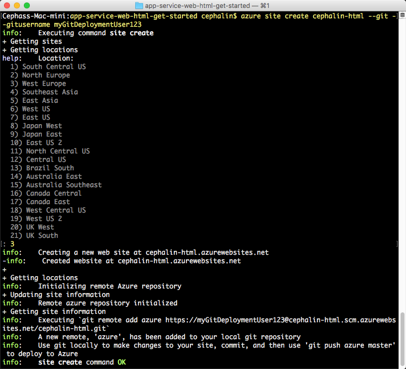
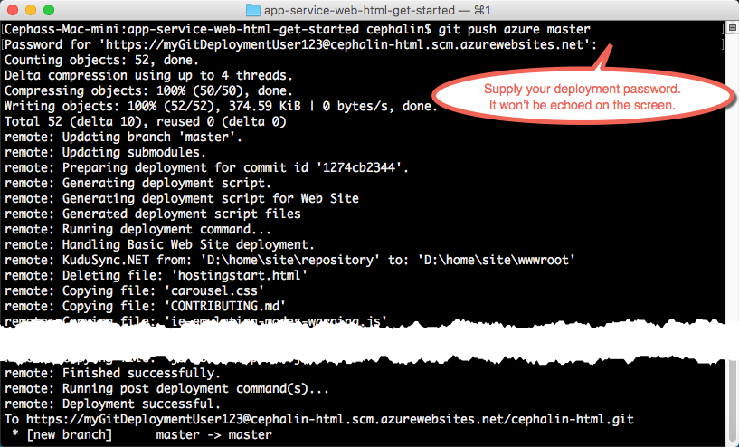

## Demo Prerequisites
- [Install Bash on Windows](https://msdn.microsoft.com/commandline/wsl/install_guide)
- [Install CLI 2.0 (Preview) under Bash](https://github.com/Azure/azure-cli/blob/master/doc/preview_install_guide.md#ubuntu-1404-lts-and-bash-on-windows-build-14362)
- [Git](http://www.git-scm.com/downloads).
- [Azure CLI](../xplat-cli-install.md).
- A Microsoft Azure account. If you don't have an account, you can 
[sign up for a free trial](/pricing/free-trial/?WT.mc_id=A261C142F) or 
[activate your Visual Studio subscriber benefits](/pricing/member-offers/msdn-benefits-details/?WT.mc_id=A261C142F).

## Git based deployment
> Note: This demo is based on the [Deploy your first web app to Azure in five minutes](https://azure.microsoft.com/en-us/documentation/articles/app-service-web-get-started/) tutorial on Azure.com. It can be expanded by including [Continuous Deployment from GitHub](https://azure.microsoft.com/en-us/documentation/articles/app-service-continuous-deployment/).

### Deploy a web app
1. Open a new Windows command prompt, PowerShell window, Linux shell, or OS X terminal. Run `git --version` and `azure --version` to verify that Git and Azure CLI
are installed on your machine.

    

    If you haven't installed the tools, see [Prerequisites](#Prerequisites) for download links.

1. Log in to Azure like this:

        azure login

    Follow the help message to continue the login process.

    

1. Change Azure CLI into ASM mode, then set the deployment user for App Service. You will deploy code using the credentials later.

        azure config mode asm
        azure site deployment user set --username <username> --pass <password>

1. Change to a working directory (`CD`) and clone the sample app like this:

        git clone <github_sample_url>

    

    For *&lt;github_sample_url>*, use one of the following URLs, depending on the framework that you like:

    - HTML+CSS+JS: [https://github.com/Azure-Samples/app-service-web-html-get-started.git](https://github.com/Azure-Samples/app-service-web-html-get-started.git)
    - ASP.NET: [https://github.com/Azure-Samples/app-service-web-dotnet-get-started.git](https://github.com/Azure-Samples/app-service-web-dotnet-get-started.git)
    - PHP (CodeIgniter): [https://github.com/Azure-Samples/app-service-web-php-get-started.git](https://github.com/Azure-Samples/app-service-web-php-get-started.git)
    - Node.js (Express): [https://github.com/Azure-Samples/app-service-web-nodejs-get-started.git](https://github.com/Azure-Samples/app-service-web-nodejs-get-started.git)
    - Java: [https://github.com/Azure-Samples/app-service-web-java-get-started.git](https://github.com/Azure-Samples/app-service-web-java-get-started.git)
    - Python (Django): [https://github.com/Azure-Samples/app-service-web-python-get-started.git](https://github.com/Azure-Samples/app-service-web-python-get-started.git)

1. Change to the repository of your sample app. For example:

        cd app-service-web-html-get-started

1. Create the App Service app resource in Azure with a unique app name and the deployment user you configured earlier. When you're prompted, specify the number of the desired region.

        azure site create <app_name> --git --gitusername <username>

    

    Your app is created in Azure now. Also, your current directory is Git-initialized and connected to the new App Service app as a Git remote.
    You can browse to the app URL (http://&lt;app_name>.azurewebsites.net) to see the beautiful default HTML page, but let's actually get your code there now.

1. Deploy your sample code to your Azure app like you would push any code with Git. When prompted, use the password you configured earlier.

        git push azure master

    

    If you used one of the language frameworks, you'll see different output. `git push` not only puts code in Azure, but also triggers deployment tasks
    in the deployment engine. If you have any package.json
    (Node.js) or requirements.txt (Python) files in your project (repository) root, or if you have a packages.config file in your ASP.NET project, the deployment
    script restores the required packages for you. You can also [enable the Composer extension](web-sites-php-mysql-deploy-use-git.md#composer) to automatically process composer.json files
    in your PHP app.

You have deployed your app to Azure App Service.

### See your app running live

To see your app running live in Azure, run this command from any directory in your repository:

    azure site browse

### Make updates to your app

You can now use Git to push from your project (repository) root anytime to make an update to the live site. You do it the same way as when you deployed your code
the first time. For example, every time you want to push a new change that you've tested locally, just run the following commands from your project 
(repository) root:

    git add .
    git commit -m "<your_message>"
    git push azure master

## Azure CLI 2.0 Preview
1. Open command prompt and enter bash mode by typing `bash`
1. Walk through the install steps to [Install CLI 2.0 (Preview) under Bash](https://github.com/Azure/azure-cli/blob/master/doc/preview_install_guide.md#ubuntu-1404-lts-and-bash-on-windows-build-14362). Note that everything was pre-installed as prerequisites, so the install steps should go quickly, even over slow wi-fi. Steps are as follows: 

    ```bash
      sudo apt-get update
      sudo apt-get install -y libssl-dev libffi-dev
      sudo apt-get install -y python-dev
      curl -L https://aka.ms/InstallAzureCli | sudo bash
    ```

1. Reload the bash environment to ensure tab completion works using `exec -l $SHELL`
1. List the available commands by typing `az`
1. Demonstrate browser-integrated login by typing `az login` and following the directions.
1. Change default output format to table by typing `az configure` and selecting the opion for table.
1. List resources by typing `az resource list`.

> Note: Additional demo commands are demonstrated in the [Ignite presentation](https://myignite.microsoft.com/secondscreen/2673) at 34:00.