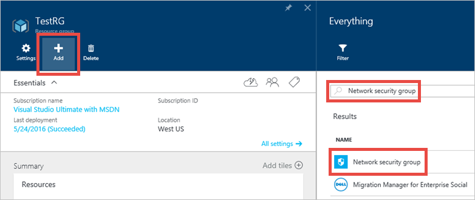
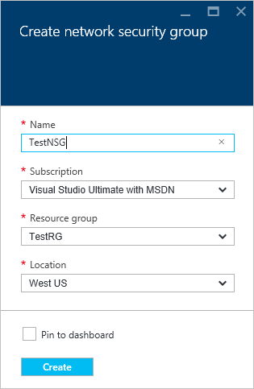
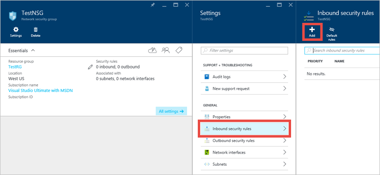
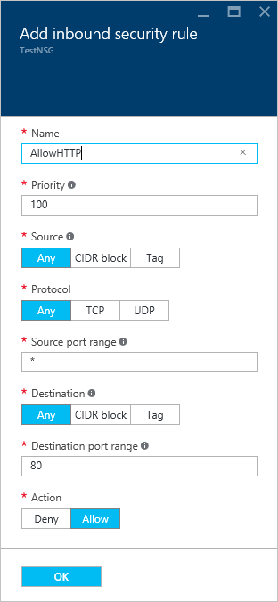
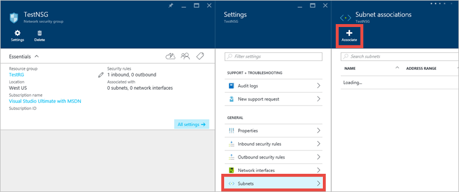
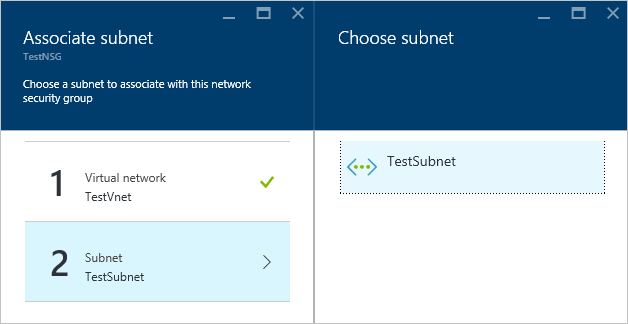

# Opening ports to a VM in Azure using the Azure Portal

The guide is based in port 80, you may need to change the port depending on the port that your application uses.

## Quick commands

First, create your Network Security Group. Select a resource group in the portal, click 'Add', then search for and select 'Network Security Group':

Enter a name for your Network Security Group and select a location:

Select your new Network Security Group. You now create an inbound rule:

Provide a name for your new rule. Port 80 is already entered by default. This blade is where you would change the source, protocol, and destination when adding additional rules to your Network Security Group:

Your final step is to associate your Network Security Group with a subnet or a specific network interface. Let's associate the Network Security Group with a subnet:

Select your virtual network, and then select the appropriate subnet:

You have now created a Network Security Group, created an inbound rule that allows traffic on port 80, and associated it with a subnet. Any VMs you connect to that subnet are reachable on port 80.