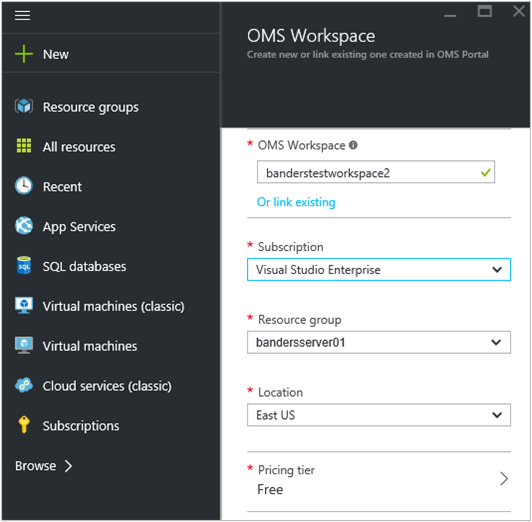

# Get started with Log Analytics

You can get up and running with Log Analytics in the Microsoft Operations Management Suite (OMS) in minutes. You have two options when choosing how to create an OMS workspace, which is similar to an account:

- Microsoft Operations Management Suite website
- Microsoft Azure subscription

For simplicity, we will use the Azure Portal.

## Sign up quickly using Microsoft Azure

1. Go to the [Azure portal](https://portal.azure.com) and sign in, browse the list of services, and then select **Log Analytics (OMS)**.  
    
2. Click **Add**, then select choices for the following items:
    - **OMS Workspace** name
    - **Subscription** - If you have multiple subscriptions, choose the one you want to associate with the new workspace.
    - **Resource group**
    - **Location**
    - **Pricing tier**  
        
3. Click **Create** and you'll see the workspace details in the Azure portal.       
             
4. Click the **OMS Portal** link to open the Operations Management Suite website with your new workspace.

You're ready to start using the Operations Management Suite portal.

You can learn more about setting up your workspace and linking existing workspaces that you created with the Operations Management Suite to Azure subscriptions at [Manage access to Log Analytics](log-analytics-manage-access.md).

## Get started with the Operations Management Suite portal
To choose solutions and connect the servers that you want to manage, click the **Settings** tile and follow the steps in this section.  

  

1. **Connect a source** - Choose how you would like to connect to your server environment to gather data:
    - [Connect Linux servers with the OMS Agent for Linux.](./install-oms-agent-for-linux.md)
    - Use an Azure storage account configured with the Windows or Linux Azure diagnostic VM extension.

2. **Gather data** Configure at least one data source to populate data to your workspace. When done, click **Save**.    

    