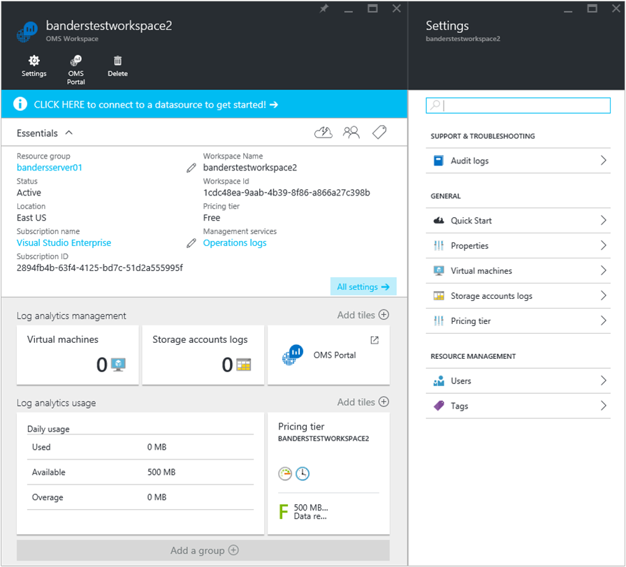
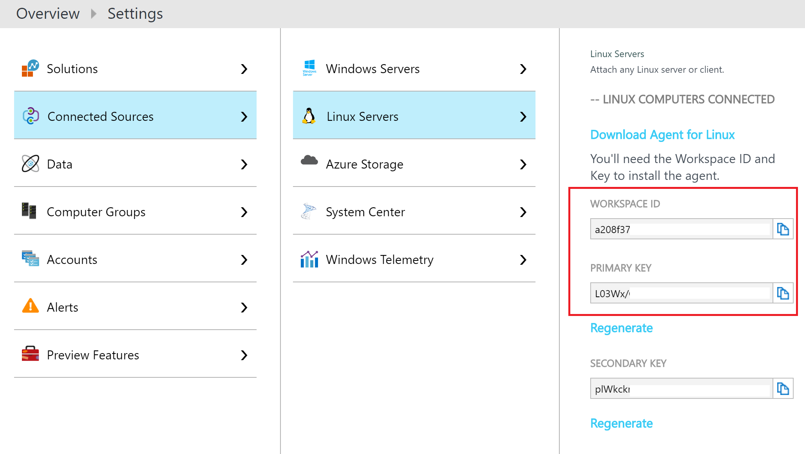

Microsoft Operations Management Suite (OMS) Log Analytics is the easy and prefferred way for logging.

To install your agent, you need to complete 2 steps

# 1. Creating an Operations Management Suite (OMS) workspace

You can get up and running with Log Analytics in the Microsoft Operations Management Suite (OMS) in minutes. You have two options when choosing how to create an OMS workspace, which is similar to an account:

- Microsoft Operations Management Suite website
- Microsoft Azure subscription

For simplicity, we will use the Azure Portal.

Please follow the below steps.

## Sign up quickly using Microsoft Azure

1. Go to the [Azure portal](https://portal.azure.com) and sign in, browse the list of services, and then select **Log Analytics (OMS)**.  
    
2. Click **Add**, then select choices for the following items:
    - **OMS Workspace** name
    - **Subscription** - If you have multiple subscriptions, choose the one you want to associate with the new workspace.
    - **Resource group**
    - **Location**
    - **Pricing tier**  
        
3. Click **Create** and you'll see the workspace details in the Azure portal.       
             
4. Click the **OMS Portal** link to open the Operations Management Suite website with your new workspace.


# 2. Installing the OMS agent to your Linux VM

Now that you have created your OMS workspace, you need to install the OMS agent to your Linux VM.

Run the following commands to download the omsagent, validate the checksum, and install+onboard the agent. *Commands are for 64-bit*. The Workspace ID and Primary Key can be found inside the OMS Portal under Settings in the **connected sources** tab.



```
wget https://raw.githubusercontent.com/Microsoft/OMS-Agent-for-Linux/master/installer/scripts/onboard_agent.sh && sh onboard_agent.sh -w <YOUR OMS WORKSPACE ID> -s <YOUR OMS WORKSPACE PRIMARY KEY>
```
It would take about 15 minutes for the logs to appear in OMS. You may continue with the next labs and return back after 15 mins to check the logs.
